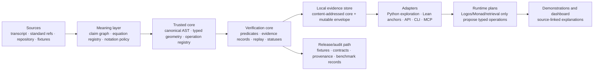

# Sovereign Engine Target Architecture and ADR Program

## Target architecture

Sovereign Engine is a layered **meaning-and-evidence platform**. The trusted path is intentionally narrower than the repository’s current application surface. No user interface, model runtime, agent, network, database, or GU theory module may redefine mathematical semantics or mark a result verified.

## Responsibility boundaries

| Layer | Owns | Must not own | Initial implementation direction |
|---|---|---|---|
| Meaning layer | Source spans, aliases, claim classes, equation IDs, uncertainty, obligations | Numerical truth or physical promotion | Versioned JSON/JSON-LD plus human guide |
| Trusted geometry core | Typed objects, index/variance rules, operation definitions, convention profiles | LLM interpretation, databases, network access | Rust-first types with language-neutral schema |
| Verification/evidence core | Predicate evaluation, `verified`/`fail`/`unverifiable`, canonical record, replay, tamper checks | UI labels, timestamps, embeddings, signing transport | Pure library and deterministic fixtures |
| Reference adapters | SymPy/EinsteinPy parity, Lean theorem links, numerical experiments | Authoritative object identity or claim status | Python and Lean adapters with explicit bridge status |
| Persistence/query | Local store, migrations, index/query adapters | Canonical serialization policy or verifier decisions | Filesystem/SQLite-compatible first |
| Runtime/agents | Intent parsing, typed operation planning, explanation | Silent core mutation or physical claims | Bounded plan/request envelopes |
| API/SDK | Transport, versioning, generated clients, contract tests | Different semantic behavior from local core | OpenAPI-first after core contracts stabilize |
| UX/demos | Visualization, education, audit journeys | Independent truth models | Evidence-linked adapters and status display |

## Mandatory cross-cutting invariants

1. A mathematical object is valid only with declared domain, tensor rank/variance, chart, convention profile, unit policy, and schema version.
2. A verifier can call only code-owned, versioned operation and predicate IDs.
3. A `verified` result names canonical inputs, assumptions, operation/predicate versions, output, residual/tolerance where applicable, and evidence hash.
4. Any missing theory definition, unsupported schema, unknown operation, absent assumption, or adapter failure returns `unverifiable` or `fail`; nothing falls through to plausible prose.
5. Mutable envelopes cannot alter the content-addressed mathematical/evidence core.
6. All adapter, API, UI, and runtime outputs preserve claim class and status.

## ADR execution program

| ADR | Decision | Options to evaluate | Default recommendation | Acceptance evidence | When it must be finalized |
|---|---|---|---|---|---|
| 001 | Green-core boundary | Full runtime / `sov-core` only / evidence-geometry core | Evidence-geometry core | Clean install, core fixture suite | Week 1 |
| 002 | Language division | Python-led / Rust core + Python adapter + Lean anchors / Lean-first | Rust core + Python reference + Lean anchors | Cross-language parity plan | Week 2 |
| 003 | Canonical evidence core | DB-coupled / pure core + adapters / external ID-centric | Pure core + adapters | Canonical/tamper vectors | Week 2 |
| 004 | Symbolic/numeric evaluation | Numeric only / symbolic only / typed dual backend | Typed dual backend | Differential fixture contract | Week 3 |
| 005 | Registry design | Dynamic callbacks / code-owned registry / plugin-managed registry | Code-owned versioned registry | Unknown-operation fail-closed test | Week 3 |
| 006 | Claim/hypothesis policy | Narrative labels / five-class graph / unbounded categories | Five-class graph + promotion ladder | Audit of public/API/demo surfaces | Week 1 |
| 007 | API/SDK strategy | Separate APIs / OpenAPI semantic core / MCP-first | OpenAPI-first semantic contract | Generated client parity | Weeks 5–6 |
| 008 | Persistence model | Graph DB first / local-first then promote / cloud-first | Local-first then promote | Offline replay and migration test | Week 4 |
| 009 | Runtime boundary | Runtime owns semantic operations / runtime proposes and core executes | Runtime proposes, core executes | End-to-end no-bypass trace | Weeks 7–8 |
| 010 | Demonstration integrity | Independent demos / source-linked adapters | Evidence-linked adapters | Outsider audit journey | Weeks 9–10 |
| 011 | Connector/Manus API policy | Ad hoc integration / zero-trust matrix / broad agent autonomy | Zero-trust matrix | Idempotency/error/redaction simulation | Week 4 |
| 012 | Release evidence | CI pass only / evidence bundle / signed artifacts only | Evidence bundle, sign later | Clean-install and tamper packet | Weeks 11–12 |

## Implementation topology

The recommended repository evolution is not an immediate repository split. First create package-level boundaries inside the current checkout and prove them. A split is considered only after the green core has stable ownership, dependency direction, CI, release evidence, and consumers.

| Package area | Current likely source | Target role | Dependency rule |
|---|---|---|---|
| `sov-evidence-geometry-core` | Seed from `crates/sov-core` plus extracted pure evidence logic | Trusted deterministic core | Depends on standard libraries and audited minimal dependencies only |
| `sov-geometry-fixtures` | New | Standard and invalid/tamper fixtures | Depends on core plus optional reference adapters |
| `sov-python-reference` | SymPy/EinsteinPy adapters and current Python geometry experiments | Exploratory/differential adapter | Must not be required for core verification |
| `sov-lean-anchors` | Existing Lean files after statement audit | Formal-reference layer | Links to core object IDs; no unverifiable build claim |
| `sov-evidence-store` | Extracted persistence/query adapters | Storage/query adapter | Cannot set verification status |
| `sov-platform-api` | Existing OpenAPI/CLI/MCP concepts | Generated-client and transport surface | Must preserve local core semantics |
| `sov-runtime-adapters` | Logos/Monad/retrieval/colony | Typed operation planner / explainer | Cannot directly mutate evidence core |
| `sov-demonstrations` | Existing explorers/dashboard/game assets | Visual/educational adapter layer | Every scene/action links to a core object/evidence ID |

## Reversal policy

Each accepted ADR receives an owner, review date, migration plan, and rollback trigger. An architectural change is reversible until it changes a published major API, evidence canonicalization format, signature trust root, or externally published claim. Those irreversible changes require a human gate and published migration/compatibility plan.
