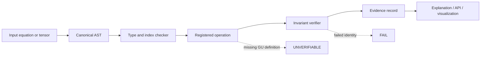

# Sovereign Engine Tensor Meaning Layer: Development Blueprint and API Contracts

**Status:** Proposed implementation contract  
**Audience:** Sovereign Engine kernel, geometry, verification, Logos, Monad, dashboard, and future adapter teams

## 1. Implementation objective

The tensor meaning layer is not a general-purpose computer algebra system and is not a claim to implement Geometric Unity’s unfinished physics. Its purpose is narrower and more defensible: represent geometric objects and operations from the transcript with explicit types, dimensions, index variance, signatures, units, assumptions, provenance, and verification status.

The system must support two modes:

| Mode | Purpose | Output policy |
|---|---|---|
| **Exact symbolic mode** | Preserve equations, index structure, assumptions, and source claims | Returns symbolic expressions and proof obligations; no unsupported numerical substitution |
| **Numerical fixture mode** | Evaluate finite-dimensional examples and test identities | Returns values, residuals, tolerances, and fixture provenance |

A third state is mandatory:

> **`unverifiable` means the expression or physical interpretation is incomplete, not that the system should guess.**

## 2. Trusted-core boundary

The first release should be a small deterministic kernel, independent of LLM generation. It should own canonicalization, typed geometry objects, index checking, operation registry, invariant checks, evidence records, and serialization. GU-specific action terms, representation claims, three-generation derivations, dark-energy mechanisms, and 75D projection choices should remain adapter-level hypotheses until their equations are explicitly specified.



## 3. Package and module layout

```text
sov_meaning/
├── canonical/
│   ├── ids.py                  # content-addressed IDs and canonical JSON
│   ├── ast.py                  # expression AST and source spans
│   └── serialization.py        # deterministic bytes and schema versions
├── tensor/
│   ├── types.py                # Tensor, Form, Vector, Covector, Spinor
│   ├── indices.py              # variance, slots, contraction compatibility
│   ├── metrics.py               # metric, inverse, signature, volume form
│   ├── connections.py           # affine, Levi-Civita, gauge connections
│   ├── curvature.py             # Riemann, Ricci, scalar, Einstein, gauge F
│   ├── torsion.py               # torsion and contortion
│   ├── forms.py                 # wedge, d, D, Hodge star, contraction
│   ├── spinors.py               # Clifford action and Dirac interfaces
│   └── actions.py               # EH, CS, and candidate action terms
├── geometry/
│   ├── manifolds.py             # X4, Y14, generic typed manifolds
│   ├── bundles.py               # base, fiber, section, pullback
│   ├── projective.py            # CP1 / Fubini-Study distance
│   ├── hopf.py                  # S3 -> S2 projection metadata
│   └── e8.py                    # roots, Weyl reflections, fixtures
├── semantics/
│   ├── claims.py                # fact, hypothesis, target, unresolved claim
│   ├── provenance.py             # source, transcript span, repository path
│   └── explanations.py          # plain-language significance
├── verify/
│   ├── registry.py              # code-owned operations and predicates
│   ├── invariants.py            # dimension, symmetry, Bianchi, d2, D2 checks
│   ├── replay.py                # deterministic evidence replay
│   └── status.py                # verified, fail, unverifiable
└── adapters/
    ├── logos.py                 # language and symbolic explanation
    ├── monad.py                 # state transitions
    ├── ledger.py                # append-only evidence
    └── visualization.py         # diagrams and tensor projections
```

## 4. Canonical data contracts

### 4.1 Manifold

```json
{
  "schema": "sov.manifold.v1",
  "id": "sha256:...",
  "name": "X4",
  "dimension": 4,
  "signature": [1, 3],
  "coordinates": ["x0", "x1", "x2", "x3"],
  "orientation": "declared",
  "status": "defined",
  "provenance": {"source": "transcript", "lines": [165, 245]}
}
```

**Invariants:** dimension is a positive integer; signature length equals dimension; signature entries are nonnegative and sum to dimension; coordinate names are unique; orientation is either `declared`, `not_declared`, or `inherited`.

### 4.2 Tensor

```json
{
  "schema": "sov.tensor.v1",
  "id": "sha256:...",
  "name": "g",
  "manifold_id": "sha256:manifold",
  "rank": {"covariant": 2, "contravariant": 0},
  "slots": [
    {"variance": "covariant", "label": "mu"},
    {"variance": "covariant", "label": "nu"}
  ],
  "dimension": 4,
  "symmetries": [{"type": "symmetric", "slots": [0, 1]}],
  "units": "dimensionless_or_declared",
  "components": {"representation": "symbolic", "value": "g_mu_nu(x)"},
  "assumptions": ["nondegenerate"],
  "provenance": {"source": "tong_gr_notes", "claim_type": "standard"}
}
```

### 4.3 Differential form

```json
{
  "schema": "sov.form.v1",
  "id": "sha256:...",
  "degree": 1,
  "manifold_id": "sha256:manifold",
  "coefficient_algebra": "lie_algebra:g",
  "expression": "A_mu(x) dx^mu",
  "orientation_required": false,
  "metric_required": false
}
```

### 4.4 Connection

```json
{
  "schema": "sov.connection.v1",
  "id": "sha256:...",
  "kind": "levi_civita | affine | gauge | spinor",
  "manifold_id": "sha256:manifold",
  "metric_id": "sha256:metric_or_null",
  "bundle_id": "sha256:bundle_or_null",
  "coefficients": "Gamma^rho_mu_nu(x)",
  "properties": {
    "metric_compatible": true,
    "torsion_free": true,
    "flat": false
  },
  "conventions": {"curvature_sign": "+-++", "torsion_sign": "standard_v1"}
}
```

### 4.5 Operation and evidence record

```json
{
  "schema": "sov.evidence.v1",
  "operation_id": "curvature.coordinate.v1",
  "inputs": ["sha256:connection"],
  "assumptions": ["smooth_chart", "coordinate_basis"],
  "outputs": ["sha256:riemann"],
  "predicates": [
    {"id": "riemann.antisym_last_pair.v1", "result": true, "residual": 0.0}
  ],
  "status": "verified",
  "canonical_hash": "sha256:...",
  "source_claims": ["sha256:transcript_span"],
  "limitations": []
}
```

The immutable core must exclude display-only labels, timestamps, and prose formatting. The verifier recomputes canonical inputs, operation, predicates, and hash. Unknown operations, unsupported schema versions, missing assumptions, or evaluation errors return `unverifiable` or `fail`; they never return `verified`.

## 5. Core API contracts

The following contracts are language-neutral. They can be exposed through Python, Rust FFI, REST, MCP, or a local CLI without changing the semantic model.

### 5.1 Register a manifold

`POST /v1/manifolds`

```json
{
  "name": "X4",
  "dimension": 4,
  "signature": [1, 3],
  "coordinates": ["x0", "x1", "x2", "x3"],
  "orientation": "declared",
  "provenance": {"source": "geometric_unity.txt", "lines": [165, 245]}
}
```

Response:

```json
{
  "id": "sha256:...",
  "schema": "sov.manifold.v1",
  "status": "created",
  "validation": {"status": "verified", "checks": ["dimension", "signature", "coordinates"]}
}
```

Errors: `400 invalid_dimension`, `400 invalid_signature`, `409 identity_collision`, `422 insufficient_provenance`.

### 5.2 Define a metric

`POST /v1/metrics`

```json
{
  "manifold_id": "sha256:x4",
  "name": "g",
  "components": "g_mu_nu(x)",
  "symmetry": "symmetric",
  "nondegenerate": true,
  "signature": [1, 3],
  "inverse": "derive_symbolically",
  "provenance": {"claim_type": "standard"}
}
```

The service must verify symmetry metadata, dimension, signature, and the inverse contract. For symbolic metrics, nondegeneracy may remain an assumption and the response must say `unverifiable_assumption` rather than silently asserting a determinant is nonzero.

### 5.3 Build a Levi–Civita connection

`POST /v1/connections/levi-civita`

```json
{
  "metric_id": "sha256:metric",
  "coordinate_chart": "chart:x4:default",
  "derive": "christoffel_formula_v1"
}
```

Postconditions:

```json
{
  "metric_compatible": "verified_or_unverifiable",
  "torsion_free": "verified_or_unverifiable",
  "connection_id": "sha256:...",
  "evidence_id": "sha256:..."
}
```

### 5.4 Compute curvature

`POST /v1/curvature/riemann`

```json
{
  "connection_id": "sha256:connection",
  "representation": "coordinate_components",
  "convention": "curvature_sign_v1"
}
```

The response includes Riemann, Ricci, scalar, and optional Einstein contractions only when each requested contraction is index-compatible. It must expose the exact contraction path:

```json
{
  "riemann_id": "sha256:...",
  "ricci_id": "sha256:...",
  "scalar_curvature_id": "sha256:...",
  "einstein_id": "sha256:...",
  "contractions": [
    {"from": "R^rho_sigma_mu_nu", "contract": ["rho", "mu"], "to": "R_sigma_nu"}
  ],
  "evidence_id": "sha256:..."
}
```

### 5.5 Compute torsion and contortion

`POST /v1/connections/torsion`

```json
{
  "connection_id": "sha256:general_connection",
  "reference_connection_id": "sha256:levi_civita",
  "compute": ["torsion", "contortion"]
}
```

The service must reject a contortion request if the two connections do not share a manifold, dimension, metric convention, or compatible bundle context.

### 5.6 Differential-form operations

`POST /v1/forms/operate`

```json
{
  "operation": "exterior_derivative | wedge | covariant_derivative | hodge_star | contraction",
  "inputs": ["sha256:form"],
  "connection_id": "sha256:connection_or_null",
  "metric_id": "sha256:metric_or_null",
  "orientation": "sha256:orientation_or_null"
}
```

Rules:

| Operation | Required context | Primary invariant |
|---|---|---|
| `exterior_derivative` | manifold | `d(dω)=0` |
| `wedge` | degree metadata | graded antisymmetry |
| `covariant_derivative` | connection and representation | output degree increases by one |
| `hodge_star` | metric and orientation | degree becomes `n-p` |
| `contraction` | vector and form/tensor | slot and variance compatibility |

### 5.7 Gauge curvature and Bianchi check

`POST /v1/gauge/curvature`

```json
{
  "connection_form_id": "sha256:A",
  "bracket_convention": "adjoint_wedge_v1",
  "compute_bianchi": true
}
```

Expected output:

```json
{
  "curvature_form_id": "sha256:F",
  "formula": "F = dA + A wedge A",
  "bianchi": {"expression": "D F", "status": "verified | fail | unverifiable"},
  "evidence_id": "sha256:..."
}
```

### 5.8 Spinor and Dirac interface

`POST /v1/spinors/dirac`

```json
{
  "manifold_id": "sha256:y14",
  "metric_id": "sha256:metric",
  "spin_structure_id": "sha256:spin_structure",
  "connection_id": "sha256:spin_connection",
  "operator": "gamma_mu_nabla_mu",
  "representation": "symbolic"
}
```

The service may construct a formal operator and Clifford-algebra obligations. It must not claim a physical spectrum, three generations, or GU validation unless the relevant representation, boundary conditions, action, and comparison data are provided.

### 5.9 Evaluate a claim

`POST /v1/claims/evaluate`

```json
{
  "claim": "The GU 14D construction derives three fermion generations",
  "expression_ids": ["sha256:..."],
  "evidence_ids": ["sha256:..."],
  "requested_level": "mathematical | software | physical"
}
```

Response:

```json
{
  "status": "unverifiable",
  "level": "physical",
  "reason_codes": ["missing_complete_action", "missing_representation_decomposition", "missing_empirical_bridge"],
  "supported_subclaims": ["Y14_dimension_count"],
  "unsupported_subclaims": ["three_generation_derivation"]
}
```

## 6. Invariant registry

The first invariant registry should include:

| ID | Predicate |
|---|---|
| `tensor.dimension.v1` | Every tensor slot dimension matches its manifold. |
| `tensor.symmetry.v1` | Declared symmetry is satisfied symbolically or numerically. |
| `metric.inverse.v1` | `g^{μρ}g_{ρν}=δ^μ_ν` within tolerance. |
| `connection.metric_compatibility.v1` | `∇_ρg_{μν}=0` when declared. |
| `connection.torsion_free.v1` | `Γ^ρ_{μν}=Γ^ρ_{νμ}` when declared. |
| `curvature.definition.v1` | Riemann expression matches registered convention. |
| `forms.exterior_nilpotence.v1` | `d²=0`. |
| `gauge.bianchi.v1` | `DF=0` under the registered bracket/convention. |
| `einstein.bianchi.v1` | `∇^μG_{μν}=0` under declared assumptions. |
| `hodge.degree.v1` | `*:Ω^p→Ω^{n-p}`. |
| `clifford.relation.v1` | `{γ^μ,γ^ν}=2g^{μν}I`. |
| `e8.reflection.v1` | Weyl reflection preserves the registered root/lattice invariant. |
| `evidence.replay.v1` | Canonical inputs, outputs, predicates, and hash reproduce. |

## 7. Storage and transport

Use canonical JSON for interchange and a binary canonical form for hashing. Store immutable core records in an append-only evidence ledger. Maintain a separate mutable display envelope containing labels, thumbnails, UI positions, and explanatory prose. The display envelope must never alter the identity of the mathematical core.

A minimal relational representation is:

```text
manifolds(id, schema, dimension, signature_json, coordinates_json, canonical_hash)
objects(id, object_type, schema, manifold_id, payload_json, canonical_hash)
relations(id, source_id, target_id, relation_type, provenance_json, canonical_hash)
operations(id, operation_name, version, input_schema, output_schema)
evidence(id, operation_id, core_hash, status, predicates_json, limitations_json)
claims(id, statement, claim_level, status, source_refs_json, evidence_refs_json)
```

## 8. Verification and release gates

Before a tensor feature is considered releasable, CI must run:

1. Schema and type tests.
2. Index-variance and contraction rejection tests.
3. Symbolic identity tests for `d²`, Bianchi, metric compatibility, and declared symmetries.
4. Numerical fixture tests with exact tolerances.
5. Serialization stability and one-character tamper tests.
6. Cross-language fixture parity for Python and Rust.
7. Claim-status tests ensuring missing GU physics returns `unverifiable`.
8. Benchmark tests separating canonicalization, tensor operation, verification, and evidence persistence.

## 9. Suggested implementation sequence

| Stage | Deliverable | Exit criterion |
|---|---|---|
| T0 | Canonical AST, IDs, tensor/index types | Invalid contraction is rejected deterministically. |
| T1 | Metric, inverse, trace, raising/lowering | Golden fixtures reproduce known identities. |
| T2 | Connections, torsion, curvature | Riemann/Ricci/Einstein paths and residuals are inspectable. |
| T3 | Differential forms and gauge operations | `d²=0`, `DF=0`, and Hodge degree contracts pass. |
| T4 | Spinor/Dirac symbolic layer | Clifford and operator obligations are typed; spectra remain bounded by evidence. |
| T5 | Claims/provenance/ledger | Every result has status, source, assumptions, and replay record. |
| T6 | Logos/Monad/dashboard adapters | A user can ask for plain-language meaning and see the derivation graph. |
| T7 | GU hypothesis adapter | Incomplete GU claims are explicit, versioned, and `unverifiable`. |

## 10. Non-goals

The first implementation must not claim to reproduce Geometric Unity’s unpublished or incomplete physical theory, derive the Standard Model, predict particle generations, prove the Riemann hypothesis, replace empirical calibration, or infer semantic truth from geometric proximity alone. It should instead make those claims **machine-auditable as claims** and make the mathematical substrate reusable.
