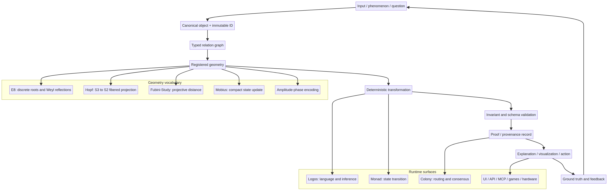
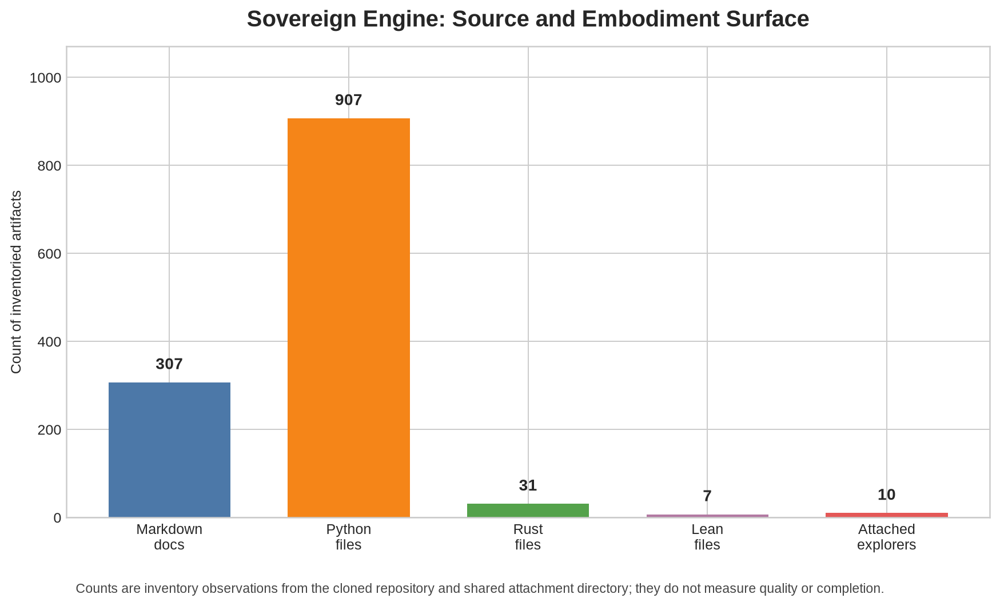
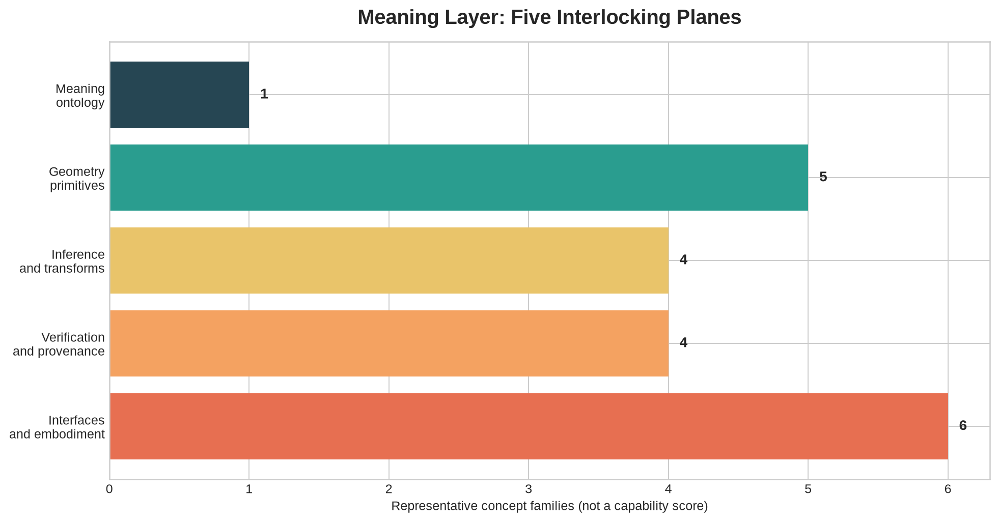
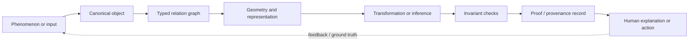

# Sovereign Engine: Meaning Layer and Full Conceptual Decode

**Prepared by Manus AI**  
**Project:** `LastFirst0/Sovereign_Engine`  
**Source basis:** supplied Geometric Unity transcript and analysis, repository at commit `167802301a1b6f658b44a80bb7b3f62b839f205a`, attached exploratory artifacts, and the external references listed at the end.

> **Working thesis:** Sovereign Engine is best understood not as one finished physical theory, but as a **geometry-native knowledge and reasoning platform** that tries to turn concepts, relations, transformations, proofs, and embodied simulations into inspectable geometric objects. Geometric Unity supplies the project’s motivating worldview; E₈, Hopf/Bloch geometry, Möbius dynamics, category-theoretic translation, ledgers, and consensus supply its proposed computational vocabulary.

## 1. The project’s identity

The project has four simultaneous identities. First, it is a **software runtime**: a Python/Rust/polyglot system with ingestion, semantic indexing, inference, verification, routing, consensus, APIs, dashboards, and hardware-facing components. Second, it is a **mathematical research program**: it proposes that invariant geometry can constrain reasoning more reliably than unconstrained statistical generation. Third, it is an **embodiment and visualization program**: the attached games, visual explorers, torus/maze/fractal/planet/particle projects, Merkaba viewer, audio sonification, and ESP32 work make abstract structures perceptible. Fourth, it is a **meaning and governance system**: identity, provenance, validation, immutable records, swarm consensus, and “sovereignty” are meant to make knowledge auditable and resistant to silent corruption.

| Identity | What it means | Evidence | Confidence |
|---|---|---|---|
| Geometry-native AI runtime | State and reasoning are represented as constrained geometric objects and transformations | `ARCHITECTURE.md`, `docs/00_Executive_Summary.md`, `sov_math/`, `sov_heart/`, Rust crates | Observed design intent |
| Verifiable knowledge kernel | Objects, relations, transformations, identities, and validation gates are explicit | `docs/archive/KERNEL_DESIGN_PLAN.md`, `sovereign_kernel/`, `sov_verify/` | Strong design intent; implementation completeness varies |
| Unified translation system | Text, language, DNA, materials, music, astronomy, and other domains are mapped through shared invariants | repository docs, `polyglot_functor/`, `sov_math/`, attached prototypes | Research hypothesis / prototype direction |
| Sovereign swarm | Nodes exchange proofs or state and reach consensus over a distributed knowledge body | `crates/sov-consensus`, `sov_heart/colony`, consensus documents | Architectural intent; empirical scale claims require validation |
| Meaning/embodiment layer | Abstract mathematics is made learnable through visual, audio, game, and hardware interfaces | attached ZIP/APK projects, Merkaba viewer, dashboards, ESP32 docs | Observed project surface |

## 2. The full story in one paragraph

The project begins with a philosophical problem: current AI can produce fluent statements without guaranteeing that the statements are true, traceable, or transferable across domains. The proposed answer is to make **structure** primary. A concept becomes an identified object; a relation becomes a first-class, provenance-bearing edge; a transformation becomes a recorded operation; and a conclusion becomes acceptable only when it preserves declared invariants and can be replayed. Geometry is the organizing language because distances, symmetries, projections, fibers, connections, curvature, and topological invariants offer more inspectable constraints than raw token likelihoods. E₈ is used as an exceptional discrete scaffold; Hopf and Bloch constructions provide lower-dimensional and phase-oriented views; Möbius maps provide compact state transitions; category/functor language expresses cross-domain translation; and ledgers, cryptographic IDs, verification, and consensus turn mathematical lineage into operational trust. The attached exploratory applications are not separate curiosities: they are **sensory and interactive front ends** for the same idea that a hidden structural space can be navigated, projected, tested, and explained.

## 3. Geometric Unity: the motivating worldview

The transcript presents Geometric Unity (GU) as an attempt to replace the assumption that the fundamental arena is a single four-dimensional spacetime with a relationship between a four-dimensional base and a higher-dimensional bundle. In the transcript’s shorthand, the classical description lives on a four-manifold `X⁴`, while a 14-dimensional total space `Y¹⁴` is constructed from the base and the ten independent components of a four-dimensional symmetric metric tensor:

\[
\dim \operatorname{Sym}^2(T_x^*X^4)=\frac{4(4+1)}{2}=10,\qquad \dim Y^{14}=4+10=14.
\]

This dimension count is an ordinary mathematical construction. It should not be confused with a demonstrated physical derivation of the Standard Model. The official GU site describes GU as an attempt to recover apparently incompatible geometries of fundamental physics from a general structure with minimal assumptions [1]. Public commentary likewise explains the 4D-plus-10D count as the bundle of symmetric bilinear forms over a four-dimensional base, while noting that the physical details were not publicly established in the early discussion [2].

The transcript’s interpretive move is more important to Sovereign Engine than the unresolved physics. It says that a field is not merely a value in a flat container; it is a **section or wave associated with a bundle**, and that the relationship between base, fiber, connection, pullback, and observer determines what can be seen. In the meaning layer, GU therefore contributes a rule:

> **Do not treat a representation as the whole object. Preserve the base, the fiber, the map between them, the local coordinates, the global gluing, and the observation/projection operation.**

| GU term | Plain-language meaning | Engine analogue | Status |
|---|---|---|---|
| `X⁴` | Four-dimensional observable/classical base | External world, task context, or low-dimensional projection | Conceptual mapping |
| Metric fiber | Possible local geometries above each base point | Configuration/state space of admissible representations | Mathematical idea; engine interpretation is proposed |
| `Y¹⁴` / observerse | Total space containing base plus metric degrees of freedom | Higher-dimensional state/meaning space | GU-inspired hypothesis |
| Section | A consistent choice of a fiber element over each base point | A represented state, embedding, or interpretation | Structural analogy |
| Connection | Rule for comparing/transporting local data | Transition/update/translation mechanism | Established mathematical term; implementation analogue varies |
| Curvature | Failure of transport around a loop to be trivial | Nontriviality, inconsistency, or accumulated transformation | Analogy, not a universal error metric |
| Torsion/contortion | Alternative measures of how a connection departs from a reference connection | Deformation or displacement channels in geometric dynamics | Transcript concept; formal engine status varies |
| Pullback | Bringing structure on a higher space back to an observation space | Rendering, decoding, projection, or domain-specific interpretation | Strong conceptual bridge |
| Spinor bundle | Bundle carrying spinorial degrees of freedom | A richer state carrier than ordinary tangent coordinates | GU motivation; not a complete engine specification |

## 4. The project’s computational geometry stack

The repository layers several different mathematical objects. They should not be collapsed into one “E₈ theory.” Each answers a different question.

### 4.1 E₈: discrete invariant scaffold

The E₈ root system has rank eight and 240 roots. A standard description consists of 112 integer-coordinate roots and 128 half-integer-coordinate roots satisfying the parity and squared-length conditions [3]. The repository uses root generation, Gram matrices, adjacency, Weyl reflections, root snapping, E₈ organism code, and related tests. The project’s distinctive claim is not merely that E₈ exists; it is that a selected E₈ representation can act as a **finite vocabulary of structurally admissible directions**.

The repository also repeatedly names a 75-dimensional invariant subspace. This is an internal design quantity, not a consequence of the bare fact that E₈ has rank eight or 240 roots. Future development must define the exact projection matrix, basis, invariance equation, and proof/test fixture for the 75D claim.

### 4.2 Weyl reflections: reversible structural moves

For a root `α`, the usual reflection of a vector `v` is

\[
s_\alpha(v)=v-2\frac{\langle v,\alpha\rangle}{\langle\alpha,\alpha\rangle}\alpha.
\]

In the Engine, a Weyl reflection is intended to be a deterministic, structure-preserving transformation. It can therefore serve as a candidate operation in a proof trace: input state, selected root, reflected state, invariant checks, and resulting identity. The reflection itself does not prove the semantic truth of a sentence; it proves only that the transformation obeyed the registered algebraic rule.

### 4.3 Hopf fibration and Bloch sphere: phase and projection

The Hopf map is a fibration from `S³` to `S²` with circular fibers. The project uses it as a way to compress or visualize richer states while retaining phase structure. A related qubit/Bloch representation is written as

\[
|\psi\rangle=\cos(\theta/2)|0\rangle+e^{i\phi}\sin(\theta/2)|1\rangle.
\]

This is a coordinate language for a normalized two-level state. It is not, by itself, evidence that the Engine performs quantum computation. In the Engine meaning layer, the Bloch sphere means **phase-aware state visualization and routing**, while the Hopf map means **fibered projection with information about what is discarded and what is preserved**. The mathematical role of Hopf fibrations and great-circle structures is established independently of the project [4].

### 4.4 Complex projective/Fubini–Study geometry: semantic distance

The architecture document uses `CP¹ ≅ S²` and a Fubini–Study-style distance:

\[
d_{FS}(z_q,z_r)=\arccos\left(\frac{|1+z_q\bar z_r|}{\sqrt{(1+|z_q|^2)(1+|z_r|^2)}}\right).
\]

Here `z_q` and `z_r` are complex projective coordinates for query and reference states. The intended meaning is that similarity should be invariant under overall complex rescaling and should respect the geometry of projective states rather than raw Euclidean coordinates. The formula is a legitimate geometric distance form; the claim that it gives “100% scale-invariant” semantic retrieval is a software/benchmark claim that must be tested, not assumed.

### 4.5 Möbius transformations: compact state updates

The Monad layer documents the update

\[
z_{k+1}=\frac{az_k+b}{cz_k+d},
\]

where the coefficients define a projective/conformal transformation. The intended computational meaning is a compact, composable update on the Riemann sphere that preserves angles where defined. The repository’s claim that this replaces general `O(N²)` matrix multiplication with `O(1)` operations is only valid for a bounded state representation in which the entire required state really is captured by the scalar/projective parameters. It cannot be generalized to all neural or semantic workloads without a benchmark and equivalence specification.

### 4.6 Complex amplitude-phase encoding

The ingestion layer represents a token or feature as

\[
z=Ae^{i\phi},
\]

with amplitude `A` interpreted as semantic weight and phase `φ` as syntactic position/context. This is a useful explanatory encoding: amplitude answers “how much,” and phase answers “where/in what relation.” The system must specify how `A` and `φ` are calculated, how multilingual ambiguity is handled, and which transformations preserve meaning.

## 5. Knowledge model: what the kernel is supposed to know

The archived kernel design gives the clearest semantic contract. The kernel should know as little as possible, but what it knows must be rigorously defined.

| Kernel layer | Canonical object | Meaning |
|---|---|---|
| Identity | Immutable content-addressed ID | What object is this, and can it be re-identified? |
| Object | Type, version, metadata, payload reference | What is being represented? |
| Relation | Source, target, type, certainty, provenance, validator | How are two objects connected, and why believe it? |
| Geometry | Distance, projection, reflection, neighbor, symmetry | What structural space contains the objects? |
| Transformation | Inputs, outputs, operation, preserved invariants, reversibility, cost | What changed, and what was guaranteed not to change? |
| Validation | Rule, severity, check, optional repair | What must be true for the state to be admitted? |
| Ledger | Append-only event/proof record | Can the history be replayed and audited? |
| Interface | API, CLI, UI, MCP, hardware | How does a person or external system observe/act? |

This is the project’s deepest unifying principle. “Everything is geometry” is operationally translated into **every meaningful operation has a typed state, a transformation, a declared invariant, and an evidence trail**.

## 6. System process: from perception to trustworthy action

The project’s recurring loop can be decoded as follows:

1. **Perceive/ingest.** Receive text, symbols, scientific data, sensor readings, or an external query.
2. **Canonicalize.** Normalize representation, language, units, ordering, and provenance.
3. **Encode.** Map the input into vectors, complex phase-amplitude coordinates, E₈ roots, projective coordinates, graph nodes, or another registered geometry.
4. **Locate.** Use a semantic registry, geodesic distance, nearest-neighbor lookup, lattice adjacency, or domain-specific index.
5. **Transform.** Apply a Weyl reflection, Möbius map, functor, projection, merge, translation, or inference rule.
6. **Validate.** Check algebraic invariants, schema constraints, type compatibility, provenance, calibration, and tamper resistance.
7. **Record.** Emit an immutable identity, relation, transformation record, proof trace, or ledger event.
8. **Coordinate.** Route the task or candidate state through the Monad, colony, consensus, or two-tier shard layer.
9. **Render/act.** Explain the result in language, visualization, audio, game interaction, dashboard form, API output, or hardware signal.
10. **Learn/revise.** Compare against ground truth, detect drift, update registries, and preserve the previous evidence rather than silently overwriting it.

The process is a **closed loop of representation and verification**, not a claim that every output is automatically true.

## 7. Capabilities and features by layer

| Layer | Capabilities found in the project | Primary locations |
|---|---|---|
| Core geometry | E₈ root generation, Gram/adjacency data, Weyl operations, lattice projection, Hopf and torus utilities | `sov_math/`, root `.npy` files, `crates/sov-e8-organism` |
| Semantic indexing | Fubini–Study/projective lookup, vector registries, atlas, manifold registries | `sov_heart/atlas`, `sov_proto`, `data/registry` |
| Inference | Logos compiler/inference, Monad state transitions, rule/proof paths, language and alphabet systems | `sov_heart/logos`, `sov_monad`, `sov_hermes` |
| Verification | Tests, Lean files, invariant checks, witness/proof concepts, cryptographic IDs | `sov_verify`, `lean_verification`, `tests/`, `logos/witness_reports` |
| Distributed operation | P2P routing, colony/swarm, gravity-well consensus, sharding, ICAP addressing | `sov_heart/colony`, `crates/sov-consensus`, consensus docs |
| Cross-domain translation | Polyglot functors, DNA/protein, materials, music/cymatics, astronomy, biological bridge | `polyglot_functor`, `sov_math/quadrivium`, `sov_verify` |
| Embodiment | Merkaba viewer, harmony dashboard, audio sonification, ESP32 communication/firmware | `docs/merkaba_*`, `dashboard`, ESP32 docs |
| Human interfaces | CLI, REST/Ollama, MCP, Web UI, games and explorers | `scripts/`, `apps/`, attached ZIP/APK projects |

## 8. Attached exploratory projects: their meaning

The attached projects make the abstract system concrete. Their value is not that each is already integrated into the kernel; it is that they provide **visual testbeds and pedagogical metaphors** for different structural ideas.

| Artifact | Likely experiential role in the meaning layer |
|---|---|
| ParticleLife 1.41 | Emergence, local rules producing global organization, interaction fields |
| GraphWorld | Nodes, relations, traversal, topology, and graph-based meaning |
| MazeLabyrinth / Spherimaze | Navigation through constrained spaces, local choices, global topology, projection |
| RotationExchanger | Symmetry operations, orientation, frame changes, and reversible transformations |
| Planet_io | Orbital/field dynamics and a physical visualization of state evolution |
| Fractals 3D/4D | Recursive generation, scale, self-similarity, and higher-dimensional projection |
| S3/S2E Explorer | Exploration of sphere/fiber or dimensional projection ideas |
| APK artifacts | Mobile embodiment and accessible interactive interfaces |

These projects should be treated as **demonstrators**, not as proof that the corresponding physical or mathematical hypotheses are correct. Their development purpose is to help users build intuition, expose invariants visually, and create reproducible interaction fixtures.

## 9. Constants, variables, and identifiers

### 9.1 Mathematical and architectural constants

| Symbol/value | Meaning in the project | Evidence status |
|---|---|---|
| `4` | Base-manifold dimension; also four classical tensor categories in transcript shorthand | Mathematical construction / project convention |
| `10` | Independent components of a symmetric rank-2 tensor in four dimensions | Established dimension count |
| `14` | `4 + 10`; GU-inspired total-space dimension | Mathematical count; physical interpretation unresolved |
| `8` | E₈ rank/coordinate dimension | Established E₈ fact |
| `240` | Number of E₈ roots | Established E₈ fact |
| `248` | Dimension of the E₈ Lie algebra | Established E₈ fact |
| `75` | Claimed invariant subspace used by the repository | Project claim requiring explicit basis/proof |
| `3` | Hopf base sphere dimension; fermion generations; manifold modes in some subsystems | Mixed: some mathematical, some project-specific |
| `2` | Hopf source/base sphere relation; projective/qubit state; two-tier sharding in architecture | Mixed |
| `144,000` | Proposed swarm/body scale | Product/system target, not observed deployment fact |
| `144` | Proposed shard count in executive material | Product/system target |
| `24` | Appears in Leech/Niemeier/moonshine-related theory material | Domain-specific mathematical constant; not automatically an Engine invariant |
| `52` | Constitutional offices in one registry claim | Project data constant |
| `6` | Merkaba shell levels in status material | Project visualization constant |

### 9.2 Core variables

`X` denotes the four-dimensional base; `Y` or `U` denotes a higher total space; `x` is a base point; `g` is a metric; `A` is a connection/gauge potential or amplitude depending on context; `φ` is phase; `F` is curvature or a feature/function depending on context; `T` denotes an operator, transformation, or torsion depending on context; `α` is a root; `v` is a vector; `z` is a complex/projective state; `θ,φ` are spherical/Bloch angles; `ID` is an immutable identity; `R` is a relation; `τ` is often a transformation parameter or Ramanujan-tau symbol in number-theoretic documents; `λ` is a stability/decay parameter in Merkaba material; `p` or `q` may denote probability, prime, or nome depending on the subsystem.

**Critical rule:** a symbol is not globally meaningful merely because it repeats. Every module needs a typed symbol table. The same letter `A`, for example, can mean amplitude, gauge potential, adjacency, or an input object.

## 10. What is established, what is implemented, and what is still a hypothesis

The repository contains strong mathematical primitives and many tests, but the project’s largest claims cross several inferential gaps. The following distinction should govern all future development.

| Claim class | Examples | How it may be stated |
|---|---|---|
| Established mathematics | E₈ has 240 roots; symmetric 4D metric has 10 components; Hopf fibration is `S³ → S²`; projective/Fubini–Study geometry exists | “The mathematical object is defined by …” |
| Repository implementation | A function generates roots; a test checks a Weyl reflection; a viewer renders a torus; an API returns a record | “The current repository implements/tests …” |
| Tested software contract | Deterministic serialization, invariant checks, expected transformation, schema validation | “The fixture/test demonstrates … under stated conditions” |
| Research hypothesis | E₈ constraints eliminate hallucination; geometric distance yields calibrated probability; functors preserve meaning across DNA/text/materials | “The project hypothesizes … and must validate …” |
| Product target | 144,000 nodes, 5,000 nodes/sec, sub-100MB core, enterprise use | “The roadmap targets …” |
| Unresolved physical claim | GU derives particle content, generations, forces, or a complete theory of nature | “Not established by the supplied evidence” |

The executive summary currently uses absolute phrases such as “hallucination-free,” “zero hallucination,” “mathematical foundations are proven,” and “100% logical consistency.” These should be rewritten as **target properties** until supported by held-out benchmarks, formal specifications, adversarial evaluation, and independent reproduction.

## 11. Meaning of “sovereignty”

“Sovereignty” has a precise technical meaning in this project when translated into engineering terms:

1. **Identity sovereignty:** objects and transformations have stable IDs and provenance.
2. **Epistemic sovereignty:** the system does not treat an external model’s fluent output as sufficient evidence.
3. **Verification sovereignty:** acceptance is determined by code-owned rules and replayable proofs, not by an opaque callback.
4. **Operational sovereignty:** nodes can function at the edge and coordinate without a single central authority.
5. **Interpretive sovereignty:** people can inspect the geometry, history, and assumptions behind a result.

It also has a rhetorical and cultural meaning involving independence from institutional gatekeeping, the “DISC,” the Logos, biblical/Aristotelian material, and the desire to recover a unified intellectual lineage. Those cultural layers matter to project identity, but they must not be silently mixed with mathematical validity or software correctness.

## 12. The development meaning layer required from now on

Future development should use a canonical ontology with five linked planes:

Every new feature should answer seven questions:

| Question | Required artifact |
|---|---|
| What is the object? | Schema and immutable identity rule |
| What space is it in? | Geometry type, dimension, coordinates, units |
| What does a relation mean? | Typed relation and provenance |
| What operation changes it? | Named transformation with pre/postconditions |
| What is preserved? | Invariant registry and test vector |
| What proves the result? | Replayable evidence record and verifier |
| How is it explained? | Plain-language rendering plus visual projection |

The minimum trusted kernel should remain small: identity, object, relation, geometry interface, deterministic transformations, validation gates, canonical serialization, and evidence replay. Domain adapters—language, biology, materials, music, games, theology, astronomy, and hardware—should plug into this kernel rather than redefine its truth model.

## 13. Recommended next milestones

### M7-A: Truth recovery
Create a claim registry with one row for every major public assertion. Each row should cite source paths, identify whether the claim is mathematical, measured, tested, or hypothetical, and name the missing evidence.

### M7-B: Canonical geometry contracts
Publish exact schemas for E₈ roots, the 75D projection, Hopf projection, Fubini–Study distance, Möbius state, and amplitude-phase encoding. Include dimensions, normalization, units, numerical tolerances, and golden fixtures.

### M7-C: Proof and provenance kernel
Implement deterministic canonicalization, content-addressed identities, code-owned operation/predicate registries, replayable proofs, tamper tests, and explicit `verified`, `fail`, or `unverifiable` outcomes.

### M7-D: Cross-domain falsification suite
Use held-out tasks in text, DNA/protein, materials, and graph reasoning. Compare against strong baselines. Measure accuracy, calibration, rejection behavior, semantic preservation, latency, memory, and adversarial robustness.

### M7-E: Visual meaning atlas
Turn the attached projects into a linked curriculum: one interaction per concept, one invariant to observe, one equation, one plain-language explanation, and one reproducible fixture.

## 14. Final identity statement

> **Sovereign Engine is a proposed sovereign, geometry-native knowledge organism: a small verifiable kernel surrounded by geometric representations, cross-domain translators, inference loops, consensus mechanisms, and embodied interfaces. Its central promise is not that geometry magically makes every statement true. Its central promise is that every admitted statement should have an explicit representation, a declared transformation history, inspectable invariants, and a clear boundary between what is proven, what is implemented, what is measured, and what remains a hypothesis.**

## References

[1]: https://geometricunity.org/ "Geometric Unity official site"
[2]: https://www.math.columbia.edu/~woit/wordpress/?p=5927 "Peter Woit, Eric Weinstein on Geometric Unity"
[3]: https://aimath.org/e8/e8.html "American Institute of Mathematics, What is E8?"
[4]: https://arxiv.org/abs/2203.12404 "Fourtzis, Markellos, and Savas-Halilaj, Gauss maps of harmonic and minimal great circle fibrations"
[5]: https://arxiv.org/abs/2304.07116 "Choudhury, Riemannian Metric Bundle"
[6]: https://ncatlab.org/nlab/show/fiber+bundles+in+physics "nLab, fiber bundles in physics"
[7]: https://ncatlab.org/nlab/show/geometric+quantization "nLab, geometric quantization"

## Local source files

- `/home/ubuntu/projects/sov-e4e91854/geometric_unity.txt`
- `/home/ubuntu/projects/sov-e4e91854/geometric_unity_analysis.txt`
- `/home/ubuntu/sovereign_engine/ARCHITECTURE.md`
- `/home/ubuntu/sovereign_engine/docs/00_Executive_Summary.md`
- `/home/ubuntu/sovereign_engine/docs/archive/KERNEL_DESIGN_PLAN.md`
- `/home/ubuntu/sovereign_engine/PROJECT_STATUS_AND_ROADMAP.md`
- `/home/ubuntu/projects/sov-e4e91854/external_source_findings.md`
